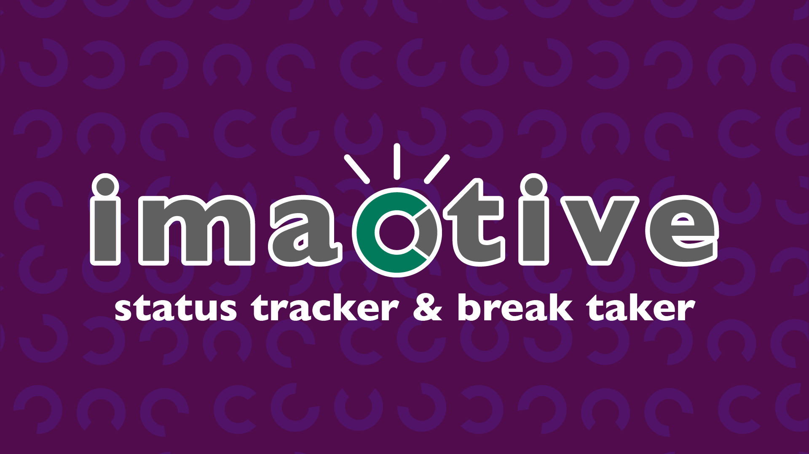
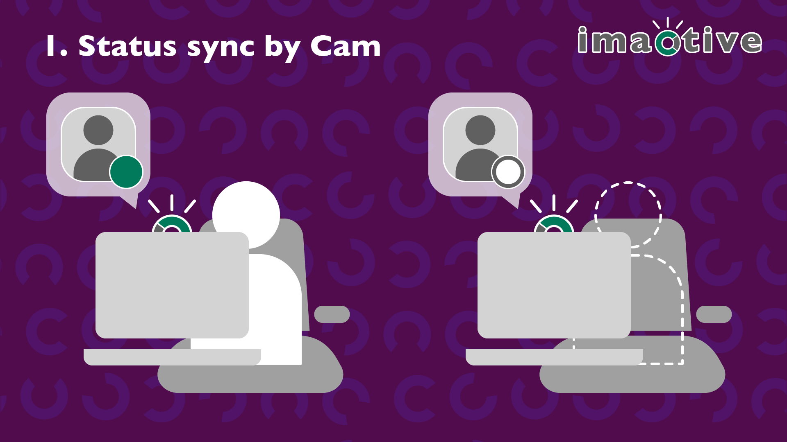
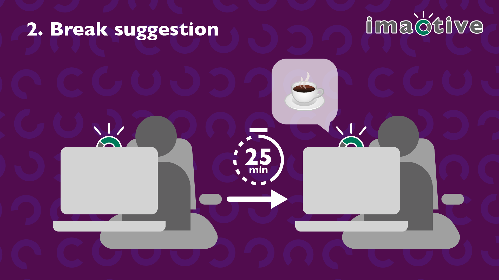
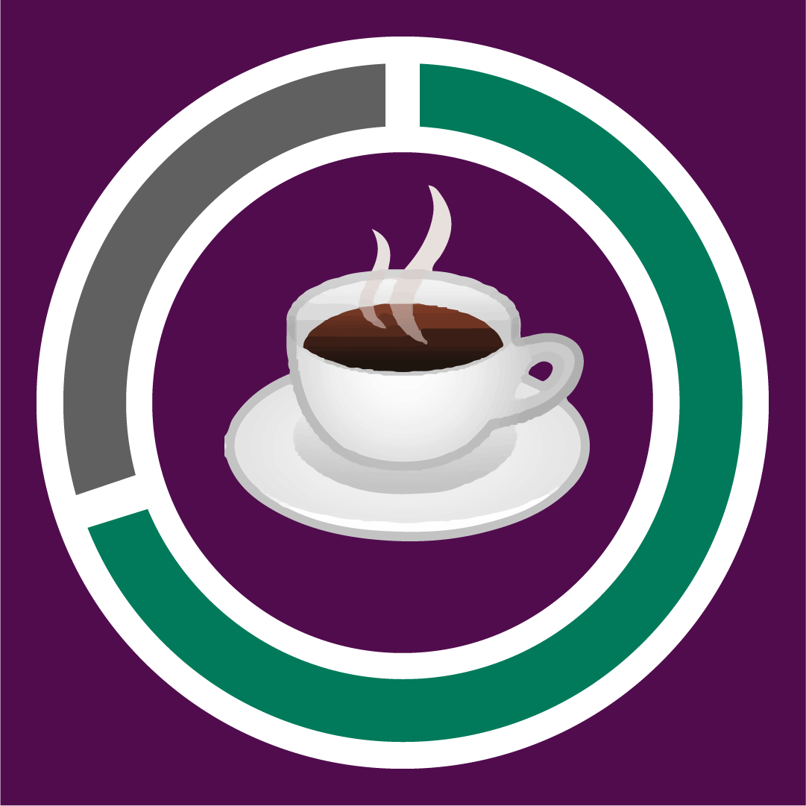

# Work efficient with your status and coffee!

<table>
  <tr>
    <td colspan=2>
      <b>imactive</b> is an slack application which bring your workspace a efficiency and cups of coffee!
    </td>
  </tr>
  <tr>
    <td>
      
    </td>
    <td width="80%">
      <li>The latest status of users will be visualized with the duration information.</li>
      <li>If users are working for a long time, it reminds that user to take a coffee break, or a tea break!</li>
      <li>The user status could be managed by your camera, too(optional).</li>
    </td>
  </tr>
</table>